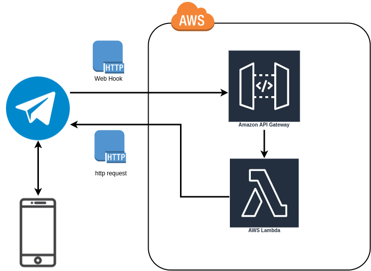

# Telegram bot with Amazon Lambdas and API Gateway


## Why you should deploy Telegram bot with lambdas
- functional programing
- It's cheaper my dude. 1 million requests per month, and 400,000 GB-seconds of compute time on a monthly basis.

## Set the lambda function
1. Create a function
    - Author from scratch
    - give it a name
    - Select Runtime: Python
2. Copy or uplad a Zip File
3. Setup enviromental variables
    - TELEGRAM_TOKEN: 1381220064:AAFKrPea0aBMhAjlXwkmbZLkOm3PIlqDp0g
    - CHAT_ID: 516150003
4. Test!
5. Deploy!

### Generate a zip file
```
pip install --target ./package requests
cd package/
zip -r9 ${OLDPWD}/function.zip .
zip -g function.zip lambda_function.py
```


### Example test
```
{
  "update_id": 1234,
  "message": {
    "message_id": 1,
    "from": {
      "id": 516150003,
      "is_bot": false,
      "first_name": "Eric",
      "last_name": "R",
      "username": "CodinEric",
      "language_code": "en"
    },
    "chat": {
      "id": 1234,
      "first_name": "Eric",
      "last_name": "R",
      "username": "CodinEric",
      "type": "private"
    },
    "date": 1601136815,
    "text": "/start",
    "entities": [
      {
        "offset": 0,
        "length": 6,
        "type": "bot_command"
      }
    ]
  }
}
```
## Set the API Gateway
- Create a REST API
- Click the actions drop-down and select create method.
- Click on the green POST after clicking the check-mark, and select Lambda function as the integration type.
- Setup test on the “Client” box. Add the same test as in the lambda
- Deploy API 
- If something is not working you may need to setup CORS

## Set Telegram Webhook
- Replace `<ACCESS_TOKEN>` with your Telegram HTTP API access token obtained in the first step.<br>
- Replace `<INVOKE_URL>` with your Invoke URL obtained in the previous step.<br>
Run:
```
$ curl --data "url=<INVOKE_URL>" "https://api.telegram.org/bot<ACCESS_TOKEN>/setWebhook"
```
You should get back a response similar to this:
```
$ {"ok":true,"result":true,"description":"Webhook was set"}
```

## refs
- https://medium.com/@wk0/running-a-serverless-telegram-bot-from-aws-lambda-759b71e13218
- https://medium.com/@wk0/integrating-your-serverless-telegram-bot-with-aws-api-gateway-8a6227d05eb4